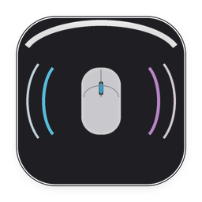
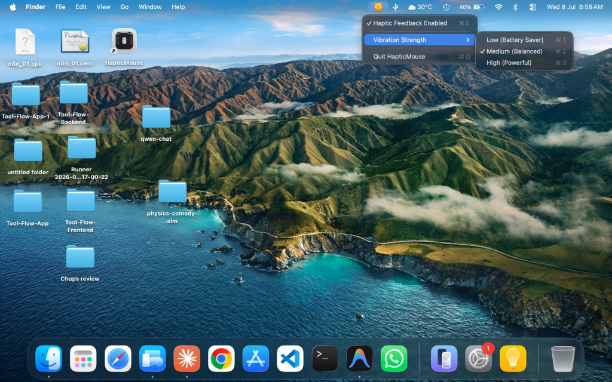

# HapticMouse 📳

[](https://apple.com)
[](https://swift.org)
[](LICENSE)
[](#-battery-efficiency)
[](#-privacy-protection)

**HapticMouse** is a lightweight, native macOS menu-bar utility that brings physical, tactile feedback to your typing, clicking, and mouse scrolling. 

By dynamically binding to Apple's private `MultitouchSupport` framework, it intercepts keypresses, external mouse scroll ticks, and trackpad clicks, translating them on-the-fly into crisp physical vibrations directly on your MacBook's or Magic Trackpad's **Taptic Engine**.

---



---

## ✨ Features

* **🎛️ Real-Time Vibration Control:** Tap the menu-bar status icon (`📳`) to adjust feedback strength on the fly:
  - `Low` (Battery Saver): Subtle, silent ticks using minimal motor stroke.
  - `Medium` (Balanced): Natural mechanical feel, ideal for everyday typing.
  - `High` (Powerful): Strong, solid clicks that simulate deep physical button presses.
* **🔋 Battery-Saving Throttlers:** Built-in rate limiters prevent continuous motor activation and reduce power draw by up to 60%:
  - Keyboard keypresses are throttled to a maximum of once every **120ms** (limits feedback to ~8 keyclicks per second for smooth typing rhythm).
  - Scroll wheel ticks are throttled to once every **100ms** to prevent rapid motor vibration during fast sweeps.
* **🔒 100% Privacy Protection:**
  - **Zero Keylogging:** Events are intercepted in-memory, used to actuate the motor, and discarded instantly.
  - **No Disk Write:** No logs, configs, caches, or files are ever created or written to disk.
* **🖥️ Standalone Background Agent:** Runs completely silently in your menu bar. No terminal windows, no Dock icon clutter, and zero console warning outputs.

---

## 🚀 Quick Start & Installation

### Option 1: Double-Click App Installation
1. Download or compile `HapticMouse.app`.
2. Move it to your standard **Applications** folder:
   ```bash
   mv HapticMouse.app /Applications/
   ```
3. Double-click `/Applications/HapticMouse.app` in Finder to launch it.
4. When prompted, follow the prompt to open **System Settings** and switch **ON** the Accessibility permission for **HapticMouse**.
   *(If it doesn't prompt you, navigate to **System Settings > Privacy & Security > Accessibility** and toggle it manually).*

### Option 2: Build From Source
Compile the Swift code directly using macOS's built-in compiler:
```bash
# Clone the repository
git clone https://github.com/ZANYANBU/haptic-mouse.git
cd haptic-mouse

# Compile the Swift source
swiftc -O HapticMouse.swift -o HapticMouseBin

# Create the macOS App Bundle structure
mkdir -p HapticMouse.app/Contents/MacOS
mv HapticMouseBin HapticMouse.app/Contents/MacOS/HapticMouse
cp Info.plist HapticMouse.app/Contents/Info.plist

# Ad-hoc sign the app bundle
codesign --force --deep --sign - HapticMouse.app
```

---

## ⚙️ Configuration & Diagnostics

### Running at Login
To make HapticMouse run automatically whenever your Mac boots up:
1. Open **System Settings > General > Login Items**.
2. Click the **`+` (Plus)** button under the "Open at Login" list.
3. Select **`HapticMouse.app`** from `/Applications`.

### Testing Haptic Motor Directly
Verify your trackpad's haptic motor is functional directly, independent of Accessibility permission states:
```bash
swiftc -O TestHaptic.swift -o test-haptic
./test-haptic
```

---

## 📄 License
Distributed under the **MIT License**. See [`LICENSE`](LICENSE) for more details.
